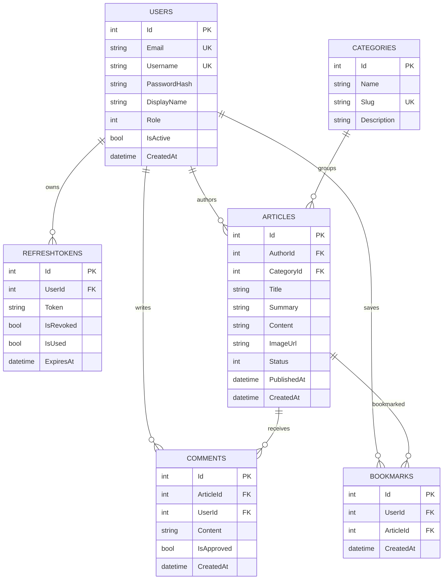
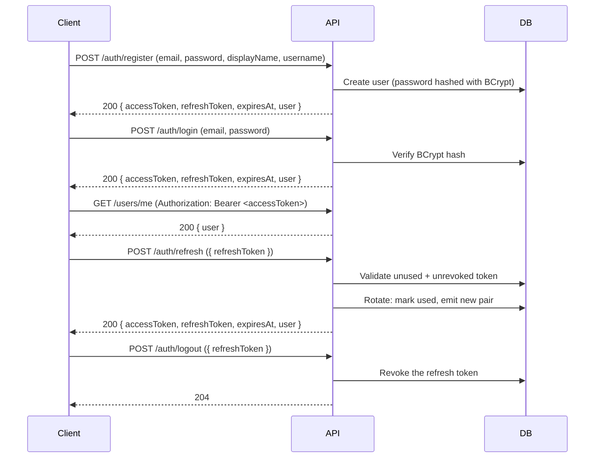

# News Backend API

A production-style REST API for a news platform, built with **Clean Architecture** on .NET 10. It covers authentication with JWT refresh tokens, articles with publish/archive workflows, category management, comment moderation, per-user bookmarks, and Cloudinary-powered profile photos.

The API is swappable-friendly: the database and JWT configuration come from environment variables / user secrets, and a development-only seeder populates an empty database with demo data so a clone can be explored immediately.

---

## Table of contents

1. [Project overview](#1-project-overview)
2. [Features](#2-features)
3. [Tech stack](#3-tech-stack)
4. [Architecture](#4-architecture)
5. [Project structure](#5-project-structure)
6. [Database diagram](#6-database-diagram)
7. [Authentication flow](#7-authentication-flow)
8. [API endpoints](#8-api-endpoints)
9. [Setup instructions](#9-setup-instructions)
10. [Environment variables](#10-environment-variables)
11. [EF Core migration commands](#11-ef-core-migration-commands)
12. [Cloudinary configuration](#12-cloudinary-configuration)
13. [Swagger instructions](#13-swagger-instructions)
14. [Screenshots](#14-screenshots)
15. [Future improvements](#15-future-improvements)

---

## 1. Project overview

The News Backend API exposes everything a small news product needs:

- **Reader-facing** features: browsing published articles with search, filtering, sorting and pagination; reading article details; listing comments.
- **Author/content features**: creating, editing, deleting, publishing and archiving articles; editing comments.
- **Admin features**: category CRUD, comment approval/rejection (moderation), full content control.
- **Account features**: register, login, refresh, logout, profile editing and Cloudinary profile-photo upload.

Every response uses a consistent JSON shape, errors are returned as a unified `ErrorResponse` with a trace id, and OpenAPI/Swagger documentation is generated and served automatically.

---

## 2. Features

- **Authentication & accounts**
  - JWT access tokens + rotating refresh tokens with reuse detection
  - Register, login, refresh, logout
  - Current-user profile, profile updates, photo upload
- **Users & roles** — `User`, `Editor`, `Admin` roles enforced per endpoint
- **Categories** — admin CRUD, unique auto-generated slugs
- **Articles**
  - Draft → Published → Archived state machine with conflict guards
  - Search (`search=`), filtering by category and status, sorting (`publishedAt`/`createdAt`/`title`), pagination
  - Drafts are private to Editors/Admins; the public API only returns published articles
- **Comments**
  - Authenticated users create comments (auto-approved)
  - Owners can update/delete their comments
  - Admins approve/reject comments to hide or restore them
- **Bookmarks** — per-user bookmark/un-bookmark with duplicate prevention (HTTP 409)
- **Profile photos** — Cloudinary upload (JPG/PNG/WebP, max 5 MB) + remove
- **API quality** — unified error responses with `traceId`, validation error mapping, CORS, health check endpoint (`/api/v1/health`), OpenAPI + Swagger UI
- **Demo seeding** — Development-only seeder fills an empty database with demo users, categories, articles, comments and bookmarks

---

## 3. Tech stack

| Layer | Technology |
| --- | --- |
| Runtime & language | .NET 10, C# |
| API framework | ASP.NET Core (Controllers) |
| Database | SQL Server (EF Core) |
| ORM | Entity Framework Core 10 |
| Authentication | JWT Bearer (Microsoft.AspNetCore.Authentication.JwtBearer) |
| Password hashing | BCrypt.Net |
| Image hosting | Cloudinary (CloudinaryDotNet) |
| API docs | Microsoft.AspNetCore.OpenApi + Swagger UI |
| Solution format | .NET 10 SDK-style solution (`NewsBackend.slnx`) |

---

## 4. Architecture

The solution follows **Clean Architecture** with strict dependency direction: inner layers never reference outer layers.

```text
NewsBackend.Domain          Entities, enums — no dependencies
        ▲
NewsBackend.Application     DTOs, interfaces (services), exceptions, validation
        ▲
NewsBackend.Infrastructure  EF Core (DbContext, migrations, configurations), services, security
        ▲
NewsBackend.API             Controllers, middleware, OpenAPI configuration, composition root
```

Dependency inversion is done in `NewsBackend.API/Program.cs` (issuing `services.AddInfrastructure()`), which registers implementations from Infrastructure against interfaces defined in Application. The controllers only know the Application interfaces.

Cross-cutting API behavior (error handling, JWT challenge/forbidden responses, validation responses, CORS, health checks, OpenAPI bearer security) is centralized in `Program.cs` or the `ExceptionHandlingMiddleware`.

---

## 5. Project structure

```text
news-app-backend/
├── NewsBackend.slnx
├── .env.example
├── .gitignore
├── README.md
├── HOW_TO_RUN.md
├── NewsBackend.API/                    # ASP.NET Core host / REST layer
│   ├── Controllers/                    #   Auth, Users, Categories, Articles, Comments, Bookmarks
│   ├── Middleware/                     #   ExceptionHandlingMiddleware, ErrorResponse
│   ├── Extensions/                     #   ClaimsPrincipal helpers
│   ├── Program.cs                      #   Composition root, OpenAPI, pipeline
│   ├── appsettings.json
│   └── Properties/launchSettings.json
├── NewsBackend.Application/            # Business contracts (no dependencies)
│   ├── DTOs/                           #   Auth, Users, Categories, Articles, Comments, Common
│   ├── Interfaces/                     #   IAuthService, IArticleService, ... IDbSeeder
│   └── Exceptions/                     #   ApiException, NotFound, Conflict, Forbidden, Validation
├── NewsBackend.Domain/                 # Core domain
│   ├── Entities/                       #   User, Category, Article, Comment, Bookmark, RefreshToken
│   └── Enums/                          #   UserRole, ArticleStatus
└── NewsBackend.Infrastructure/         # Persistence + external services
    ├── Persistence/                    #   NewsDbContext, migrations, entity configs, DatabaseSeeder
    ├── Security/                       #   JwtProvider, JwtOptions
    └── Services/                       #   Auth, User, Category, Article, Comment, Bookmark, Cloudinary
```

---

## 6. Database diagram



Key behaviours enforced by EF Core configurations:

- `Users.Email` and `Users.Username` are unique.
- `Categories.Slug` is unique.
- An article's author and category use `DeleteBehavior.Restrict` — you cannot delete an author or category that still has articles.
- Deleting an article cascades to its comments and bookmarks.

---

## 7. Authentication flow

The API issues **short-lived JWT access tokens** (15 minutes by default) plus **rotating refresh tokens** (7 days by default).



Security details:

- Access tokens are validated with issuer, audience, lifetime and signing-key validation.
- **Reuse detection**: a refresh token can only be used once; replaying an already-used token returns `401`.
- Each user stores the current valid refresh token per account; a profile photo can be uploaded via `POST /users/me/photo`.
- Protected endpoints respond with a unified `401`/`403` `ErrorResponse` when the token is missing/invalid or the role is insufficient.

---

## 8. API endpoints

All endpoints are prefixed with `/api/v1`. "Public" endpoints require no token.

### Auth

| Method | Path | Auth | Description |
| --- | --- | --- | --- |
| POST | `/auth/register` | Public | Register a user, returns tokens |
| POST | `/auth/login` | Public | Login, returns tokens |
| POST | `/auth/refresh` | Public | Exchange a refresh token for a new pair |
| POST | `/auth/logout` | Bearer | Revoke the given refresh token |
| GET | `/auth/me` | Bearer | Get the current authenticated user |

### Users

| Method | Path | Auth | Description |
| --- | --- | --- | --- |
| GET | `/users/me` | Bearer | Current user profile |
| PATCH | `/users/me` | Bearer | Update displayName / username / phoneNumber / bio |
| POST | `/users/me/photo` | Bearer | Upload profile photo (multipart form field `file`) |
| DELETE | `/users/me/photo` | Bearer | Remove profile photo URL |

### Categories

| Method | Path | Auth | Description |
| --- | --- | --- | --- |
| GET | `/categories` | Public | List all categories |
| GET | `/categories/{id}` | Public | Get one category |
| POST | `/categories` | Admin | Create category (`name`, `description?`; slug generated) |
| PUT | `/categories/{id}` | Admin | Update category |
| DELETE | `/categories/{id}` | Admin | Delete category (conflicts with articles → error) |

### Articles

| Method | Path | Auth | Description |
| --- | --- | --- | --- |
| GET | `/articles` | Public* | List published articles. Query: `page`, `limit`, `search`, `category` (slug), `sortBy` (`publishedAt`/`createdAt`/`title`), `order` (`asc`/`desc`). `status` filter is Editor/Admin-only. |
| GET | `/articles/{id}` | Public* | Get article (drafts only visible to Editor/Admin) |
| POST | `/articles` | Editor, Admin | Create article (`title`, `summary?`, `content`, `imageUrl?`, `categoryId`) → `201` |
| PUT | `/articles/{id}` | Editor, Admin | Update article |
| DELETE | `/articles/{id}` | Editor, Admin | Delete article → `204` |
| POST | `/articles/{id}/publish` | Editor, Admin | Publish (Draft → Published); archived → `409` |
| POST | `/articles/{id}/archive` | Editor, Admin | Archive (→ Archived); re-archive → `409` |

*\* Draft and status-filtered results require an Editor or Admin bearer token.*

### Comments

| Method | Path | Auth | Description |
| --- | --- | --- | --- |
| POST | `/articles/{articleId}/comments` | Bearer | Create comment (`content`) → `201` |
| GET | `/articles/{articleId}/comments` | Public | List approved comments for an article |
| PUT | `/comments/{id}` | Bearer (owner) | Update own comment |
| DELETE | `/comments/{id}` | Bearer (owner) | Delete own comment → `204` |
| POST | `/comments/{id}/approve` | Admin | Approve a comment (restores visibility) |
| POST | `/comments/{id}/reject` | Admin | Reject a comment (hides it) |

### Bookmarks

| Method | Path | Auth | Description |
| --- | --- | --- | --- |
| GET | `/bookmarks` | Bearer | List the current user's bookmarked articles (newest first) |
| POST | `/articles/{articleId}/bookmark` | Bearer | Bookmark an article → `204`; duplicate → `409`; missing → `404` |
| DELETE | `/articles/{articleId}/bookmark` | Bearer | Remove bookmark → `204`; not bookmarked → `404` |

### Operations

| Method | Path | Auth | Description |
| --- | --- | --- | --- |
| GET | `/health` | Public | Liveness check (returns `200` + `"Healthy"`) |

**Error shape** — every error response uses the same body:

```json
{ "statusCode": 404, "message": "Article not found.", "errors": null, "traceId": "0HN..." }
```

---

## 9. Setup instructions

Prerequisites:

- [.NET 10 SDK](https://dotnet.microsoft.com/download) (or newer)
- A reachable SQL Server instance (SQL Server Developer/Express or LocalDB)
- Optional: [Cloudinary](https://cloudinary.com) account for profile-photo uploads

Quick start (see [HOW_TO_RUN.md](HOW_TO_RUN.md) for the full walkthrough):

```bash
# 1. Clone
git clone https://github.com/<your-user>/news-app-backend.git
cd news-app-backend

# 2. Set the SSH secrets (inside NewsBackend.API/)
dotnet user-secrets init
dotnet user-secrets set "ConnectionStrings:DefaultConnection" "Server=localhost;Database=NewsDb;Trusted_Connection=True;MultipleActiveResultSets=true;TrustServerCertificate=True"
dotnet user-secrets set "Jwt:Secret" "a-long-random-secret-of-at-least-32-chars"

# 3. Create the database and apply migrations
dotnet tool restore
dotnet ef database update --project NewsBackend.API

# 4. Run
dotnet run --project NewsBackend.API

# 5. Open Swagger
# http://localhost:5191/swagger
```

On first run in the `Development` environment, an **empty database is automatically seeded** with demo data (see [HOW_TO_RUN.md](HOW_TO_RUN.md#demo-data)). If the database already contains users, seeding is skipped.

---

## 10. Environment variables

The application reads configuration from standard .NET sources (user secrets in development, environment variables, or your own appsettings). In non-development environments, provide the values via **environment variables** using `__` as the section separator. A template with placeholder values is in [`.env.example`](.env.example).

| Variable | Required | Description |
| --- | --- | --- |
| `ConnectionStrings__DefaultConnection` | Yes | SQL Server connection string |
| `Jwt__Secret` | Yes | Signing key for JWT (HS256, **at least 32 characters**, keep secret) |
| `Jwt__Issuer` | No | Token issuer (default `NewsBackend`) |
| `Jwt__Audience` | No | Token audience (default `NewsBackendClient`) |
| `Jwt__AccessTokenExpiryMinutes` | No | Access-token lifetime (default `15`) |
| `Jwt__RefreshTokenExpiryDays` | No | Refresh-token lifetime (default `7`) |
| `Cloudinary__CloudName` | No | Cloudinary cloud name (required only for photo upload) |
| `Cloudinary__ApiKey` | No | Cloudinary API key |
| `Cloudinary__ApiSecret` | No | Cloudinary API secret |
| `Cloudinary__Folder` | No | Cloudinary upload folder (default `profile-images`) |
| `Cors__AllowedOrigins` | No | Comma/array of origins; `*` allows all (default `*`) |

> Development shorthand: use `dotnet user-secrets set "Key" "value"` with dot-notation keys — e.g. `"Jwt:Secret"`. Never commit real values.

---

## 11. EF Core migration commands

The `DbContext` lives in `NewsBackend.Infrastructure` (`NewsDbContext`); migrations are stored in `NewsBackend.Infrastructure/Persistence/Migrations`.

```bash
# Install the local EF tool (uses .config/dotnet-tools.json if present)
dotnet tool restore

# Create a migration after model changes
dotnet ef migrations add <Name> --project NewsBackend.Infrastructure --startup-project NewsBackend.API

# Apply migrations to the database
dotnet ef database update --project NewsBackend.Infrastructure --startup-project NewsBackend.API

# Undo the last migration (remove files; also use --force to revert the DB last)
dotnet ef migrations remove --project NewsBackend.Infrastructure --startup-project NewsBackend.API

# Drop the database
dotnet ef database drop --project NewsBackend.Infrastructure --startup-project NewsBackend.API
```

> If you prefer `--project NewsBackend.API` (the app also references the migrations), that works too — the migrations assembly is `NewsBackend.Infrastructure`.

---

## 12. Cloudinary configuration

Profile-photo uploads use the Cloudinary SDK. Provide credentials via user secrets or environment variables:

```bash
dotnet user-secrets set "Cloudinary:CloudName" "your-cloud"
dotnet user-secrets set "Cloudinary:ApiKey" "your-api-key"
dotnet user-secrets set "Cloudinary:ApiSecret" "your-api-secret"
```

Behaviour:

- Endpoint: `POST /api/v1/users/me/photo` — multipart form field named `file`.
- Accepted formats: JPG, JPEG, PNG, WebP. Maximum size: **5 MB**. Anything else returns `400`.
- Uploads are stored in the configured folder (default `profile-images`) and a Cloudinary URL is saved on the user's profile.
- `DELETE /api/v1/users/me/photo` clears the profile URL (it does not destroy the file in Cloudinary).

---

## 13. Swagger instructions

Swagger UI is available **only in the `Development` environment**:

```text
http://localhost:5191/swagger          # Swagger UI
http://localhost:5191/openapi/v1.json  # OpenAPI 3.1 document
```

How to use it:

1. Open `/swagger` — a `Bearer` security scheme is preconfigured.
2. Log in or register: `POST /auth/login` with an existing account (demo accounts below) and copy `accessToken`.
3. Click **Authorize**, paste the token into the `Bearer` field, and authorize — Swagger will automatically attach `Authorization: Bearer <token>` to every request.
4. Try an authenticated endpoint, e.g. `GET /users/me`. "Persist authorization" keeps your token across page reloads, and "Display request duration" shows timings.

**Demo accounts** (created automatically by the seeder on an empty database):

| Email | Password | Role |
| --- | --- | --- |
| `admin@demo.news` | `Password123` | Admin |
| `editor@demo.news` | `Password123` | Editor |
| `user@demo.news` | `Password123` | User |

---

## 14. Screenshots

Place screenshots in `docs/screenshots/` and reference them here, for example:

```text


```

*(Images are not committed yet — add captures of Swagger UI, the article list, and the OpenAPI document when preparing the repository for presentation.)*

---

## 15. Future improvements

Ideas that are intentionally **not part of the current implementation**:

- Automatic database migration on startup (today the DB is created via `dotnet ef database update`).
- An article image-upload endpoint (articles currently accept an `imageUrl` string; Cloudinary upload exists for profile photos only).
- A media-URL deletion (destroy Cloudinary assets) endpoint.
- An automated test suite (unit + integration tests) and CI pipeline (GitHub Actions).
- Rate limiting and request logging middleware.
- Docker Compose for SQL Server + API + a pre-seeded migration image.
- Pagination improvements (cursor-based) and search relevance scoring.
- Email verification and password reset flows.
- Deployment setup (cloud hosting, HTTPS, production `appsettings`).

---

## License

No license has been selected yet. If this project is for a portfolio, consider adding an MIT license.